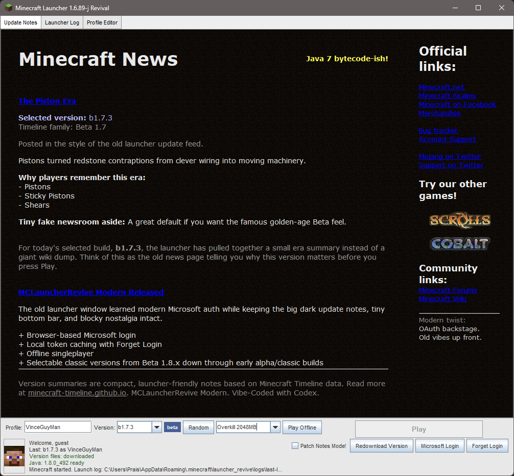

# MCLauncherRevive

[](https://github.com/VinceGuyMan/MCLauncherRevival/actions/workflows/build.yml)


A revived classic Minecraft Java launcher inspired by the February 2011 launcher UI, updated with modern Microsoft authentication and old-version launching.

The goal is intentionally weird and cozy: keep the dirt-texture news panel, tiny grey controls, old launcher proportions, and nostalgic update-feed feel, while replacing the unsafe legacy Mojang username/password login with a modern authentication chain.



Social preview/banner artwork is available at [docs/screenshots/social-preview.png](docs/screenshots/social-preview.png).

## Features

- Classic 2011-style launcher window and news/sidebar layout.
- Microsoft browser OAuth login. No raw Microsoft passwords are requested or stored.
- Modern auth chain:
  - Microsoft OAuth
  - Xbox Live authentication
  - XSTS authorization
  - Minecraft services login
  - Minecraft profile lookup
- Offline singleplayer fallback.
- Selectable classic versions from Beta 1.8.x down through old Alpha/Classic versions.
- Version download status and redownload control.
- Java runtime compatibility warnings.
- Local profile/settings page with useful folder shortcuts.
- Save backup helper.
- Texture pack `.zip` import helper.
- Lightweight Java source compiled as Java 7 bytecode, no external build system required.

## Safety first

MCLauncherRevival modernizes the login path without bringing back unsafe password handling.

| Safety area | What the launcher does |
| --- | --- |
| Microsoft password | Never asks for it and never stores it. |
| Online login | Uses browser-based Microsoft OAuth, then Xbox Live, XSTS, Minecraft services login, and profile lookup. |
| Token cache | Stores local OAuth tokens in `%APPDATA%\.minecraft\launcher_revive\auth.properties`. |
| Forget Login | Deletes cached login tokens from the launcher UI. |
| Offline mode | Keeps singleplayer available without Microsoft login. |
| XP mode | Supports offline/classic play without trying to resurrect old password login. |

## Quick start on Windows

Double-click:

```bat
Start MCLauncherRevival.cmd
```

This friendly shortcut calls `run-win7.cmd`, which handles the actual Java setup/build/run flow.

For Windows XP offline/classic mode, use:

```bat
Start MCLauncherRevival XP Offline.cmd
```

If Java is missing, the script offers to download a portable Eclipse Temurin 8 JDK into:

```text
tools\jdk8
```

That Java download is local to this folder and is not installed system-wide.

## Download a release

For normal players, the easiest path is:

1. Download the latest release zip from GitHub.
2. Extract the zip.
3. Double-click `Start MCLauncherRevival.cmd`.
4. On Windows XP, use `Start MCLauncherRevival XP Offline.cmd`.

## Build on Windows

Double-click or run:

```bat
build-win7.cmd
```

The build creates:

```text
MCLauncherRevive-modern.jar
```

Run it directly with:

```bat
java -jar MCLauncherRevive-modern.jar
```

## Supported operating systems

| Operating system | Support level | Recommended Java | Notes |
| --- | --- | --- | --- |
| Windows XP | Supported for offline/classic play | Java 7 or XP-compatible Java 8 | Use `Start MCLauncherRevival XP Offline.cmd`. Microsoft login and fresh downloads are best-effort because of XP TLS/root-certificate limits. |
| Windows 7 SP1 | Supported for full launcher experience | Java 8 | Main legacy Windows target. |
| Windows 8 / 8.1 | Supported for full launcher experience | Java 8 | Uses the normal `Start MCLauncherRevival.cmd` path. |
| Windows 10 / 11 | Supported for full launcher experience | Java 8 or newer, Java 8 recommended for old Minecraft | Best modern Windows experience. |
| Linux | Experimental/manual | Java 8-compatible runtime | Java jar may run, but `.cmd` helpers and old LWJGL natives may need manual work. |
| macOS | Experimental/manual | Java 8-compatible runtime | Old Beta/Alpha LWJGL can be fragile on modern macOS. |

The `.cmd` helper scripts are Windows-specific. The jar is compiled as Java 7 bytecode for XP-era compatibility. Windows XP is supported for offline/classic play, but modern Microsoft login and fresh downloads may not work there because of old TLS/browser/root-certificate limits. See [Windows XP notes](docs/WINDOWS_XP.md).

## Where data is stored

Minecraft files use the normal `.minecraft` folder:

```text
%APPDATA%\.minecraft
```

Launcher-specific files:

```text
%APPDATA%\.minecraft\launcher_revive
```

Token cache:

```text
%APPDATA%\.minecraft\launcher_revive\auth.properties
```

The launcher caches OAuth tokens, profile name, and UUID. It does not store Microsoft passwords. Use `Forget Login` in the launcher to remove cached tokens.

## GitHub release notes

For source control, commit the source, scripts, docs, and lightweight bundled artwork in `resources/`. Do not commit downloaded Java runtimes, build output folders, or local caches.

For a GitHub Release, attach the generated `MCLauncherRevive-modern.jar` as a release asset after building it locally or from CI.

See:

- [Windows 7 guide](docs/WINDOWS_7.md)
- [Windows XP guide](docs/WINDOWS_XP.md)
- [Authentication flow](docs/AUTH_FLOW.md)
- [Download and release guide](docs/RELEASES.md)
- [Project structure](docs/PROJECT_STRUCTURE.md)
- [Release checklist](docs/RELEASE_CHECKLIST.md)
- [Modernization notes](MODERNIZATION.md)
- [Security notes](SECURITY.md)
- [Disclaimer](docs/DISCLAIMER.md)

## Disclaimer

This is an unofficial nostalgia project. It is not affiliated with Mojang, Microsoft, Xbox, Minecraft, Scrolls/Caller's Bane, Cobalt, or any related rights holders.

Minecraft names, artwork, versions, services, and game files belong to their respective owners. Users are responsible for owning or otherwise having the right to use Minecraft Java Edition. See the full [disclaimer](docs/DISCLAIMER.md).

Vibe-Coded with Codex.
