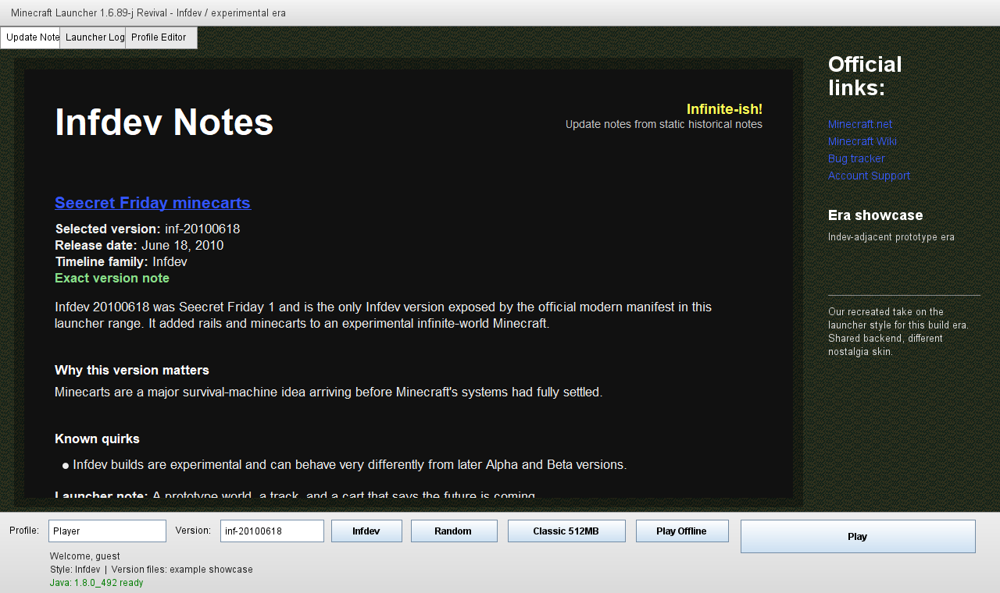
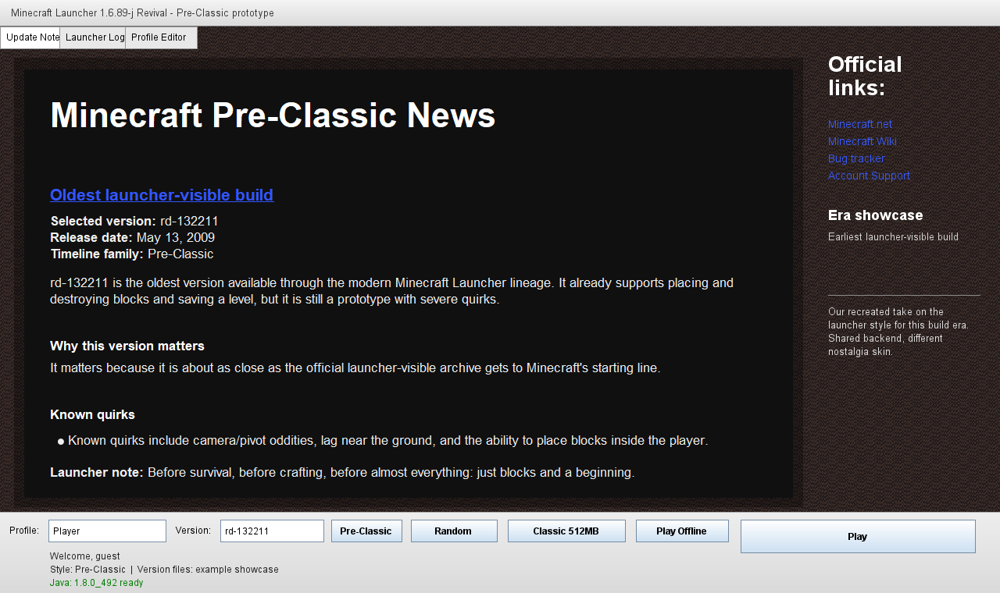
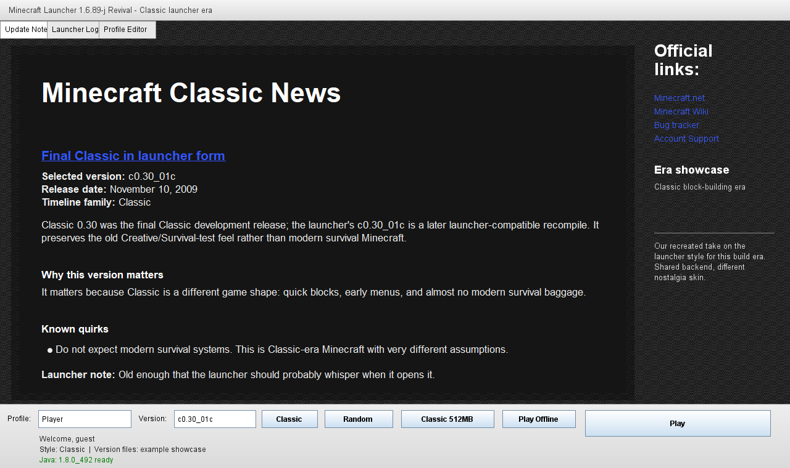
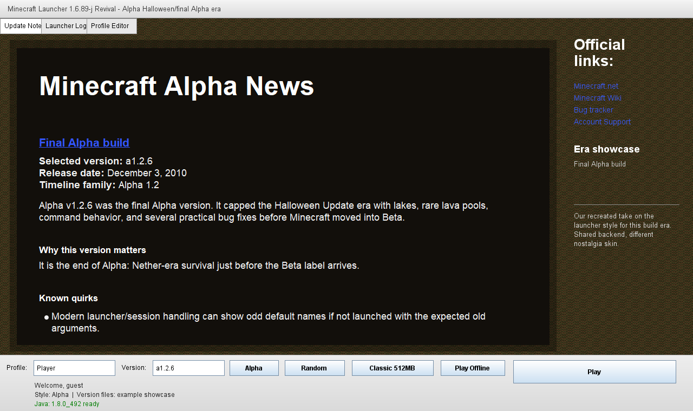
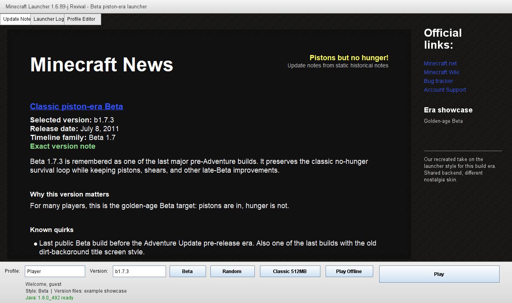

# MCLauncherRevival


A nostalgic 2011-style Minecraft launcher revival, modernized for 2026.
## 📊 Status

| Item | Status |
| --- | --- |
| Project maturity | Alpha / experimental |
| Affiliation | Unofficial; not affiliated with Mojang, Microsoft, or Minecraft |
| Purpose | Preservation, nostalgia, and learning |
| Risk | Use at your own risk |
| Official launcher replacement | No. This is not a replacement for the official Minecraft Launcher. |

## 🚀 Quick Start

1. Download the latest release from the [Releases page](https://github.com/VinceGuyMan/MCLauncherRevival/releases).
2. Extract the ZIP file.
3. Run the appropriate launcher script for your OS:
   - Windows: Double-click `Start MCLR.cmd`
   - macOS: Double-click `Start MCLauncherRevival.command`
   - Linux: Run `./scripts/run-linux.sh`

## 📸 Screenshot / preview


More screenshots and annotated UI guides are available in
[docs/SCREENSHOTS.md](docs/SCREENSHOTS.md), including:

- [Main window guide](docs/screenshots/main-window-guide.png)
- [Control bar guide](docs/screenshots/control-bar-guide.png)
- [Profile Editor](docs/screenshots/profile-editor.png)
- [Launcher Log](docs/screenshots/launcher-log.png)
- [Microsoft login flow](docs/screenshots/microsoft-login-redirect.png)
- [Backdrop artwork](docs/screenshots/backdrop.png)

### 🖼️ Era Style Showcase

MCLauncherRevival includes showcase screenshots for our recreated launcher/build-era styles:

| Era | Screenshot |
|-----|------------|
| Infdev / Prototype-era | [](docs/screenshots/era-showcase/infdev-20100618.png) |
| Pre-Classic | [](docs/screenshots/era-showcase/preclassic-rd132211.png) |
| Classic | [](docs/screenshots/era-showcase/classic-c030-01c.png) |
| Alpha | [](docs/screenshots/era-showcase/alpha-a126.png) |
| Beta | [](docs/screenshots/era-showcase/beta-b173.png) |

The v0.5.0 historical style system is documented in
[docs/HISTORICAL_THEMES.md](docs/HISTORICAL_THEMES.md).

## 🚀 What it does

### Core Features
- **Classic UI**: Presents a classic launcher-inspired Swing UI with era-aware layouts, recreated pixel textures, animated splash text, and compact bottom controls
- **Historical Styles**: Adds a `Style` selector with `Auto`, `Beta`, `Alpha`, `Infdev`, `Classic`, and `Pre-Classic` presentation modes
- **Modern Auth**: Uses a modern browser/OAuth account flow where available, with a browser desktop redirect by default and fallback options when needed
- **Offline Support**: Keeps offline singleplayer fallback behavior available
- **Version Selection**: Supports selecting and launching classic Minecraft Java versions from Beta 1.8.x downward where version metadata is available
- **Config Management**: Stores launcher settings and local token/config data under the user's `.minecraft` folder
- **Convenience Tools**: Includes shortcuts for saves backups, texture pack import, logs, and local folders
- **Performance Options**: Includes a `Potato Mode!` toggle for older machines (256MB memory, compact notes, no animated splash, smaller window)
- **RAM Presets**: Includes RAM presets from `Air 64MB` through `Overkill 8192MB`, plus `Custom`

## 🧪 What works / what is still experimental

| Area | Status | Notes |
| --- | --- | --- |
| Classic launcher UI | ✅ Working | Preserves the old launcher feel with modernized internals. |
| Historical era layouts | ⚠️ New in v0.5.0 / experimental | `Auto` maps selected versions to recreated Beta, Alpha, Infdev, Classic, or Pre-Classic launcher-inspired layouts. |
| Offline mode | ✅ Working / needs broader testing | Intended for singleplayer and older systems. |
| Microsoft login / OAuth flow | ⚠️ Experimental | Uses browser OAuth and Microsoft's registered desktop redirect by default. Local callback can be enabled only with a custom registered client ID. It should never ask for a Microsoft password inside the app. |
| Version selection | ✅ Working / needs broader testing | Classic versions are listed from Mojang metadata where available. |
| Windows 7-11 support | 🎯 Primary target | Java 8 is recommended, especially for old Minecraft/LWJGL behavior. |
| Windows XP / older Windows behavior | 💻 Offline/classic only | Real XP hardware testing confirmed classic launches can work with prepared files, Java, and drivers. Performance depends on hardware. |
| Linux behavior | 🐧 Release smoke-tested / game launch experimental | Release ZIP download/extract and `--smoke-test` passed on Kali Linux ARM64. Old Minecraft/LWJGL game launch may still fail with blank windows, OpenGL errors, or native-library issues. See docs/LINUX.md. |
| macOS behavior | 🍎 Build/UI/game-launch smoke-tested, still experimental | macOS scripts, Finder `.command`, unsigned `.app` packaging, `--smoke-test`, foreground old-client launch, and local LWJGL color correction are available. Old Minecraft/LWJGL behavior may still vary by Mac, Java, and version. See docs/MACOS.md. |
| Release packaging | 📦 Alpha packages available | Use the attached GitHub Releases ZIP, not the source-code ZIP. |

## 📥 Installation / running

### 📦 Download Pre-built (Recommended)

Use the attached ZIP asset from the GitHub Releases page.

Do not use these files for normal play:

- GitHub's green **Code -> Download ZIP** button.
- GitHub's auto-generated tag/source ZIP files.

Those source archives are useful for reading or building the code, but they may not include
`MCLauncherRevival.jar`. The attached release asset is the runnable package.

The current alpha package is:

```text
MCLauncherRevival-v0.7.1-alpha.zip
```

If an XP bundled-Java package is published, it should be named like:

```text
MCLauncherRevival-v0.7.1-alpha-xp-bundled-java.zip
```

That XP package is for offline/classic use only. It may include a maintainer-provided
XP-compatible Java runtime under `tools\java7` or local Java installer EXEs under
`tools\java-installers`. The launcher may ask before running a bundled installer if Java is missing.
Bundled Java is third-party software under its own license/readme files, and old Java runtimes are
not secure for general browsing or production use.

If a bundled-Java package is not available, follow the manual XP Java setup guide:

- [Windows XP Java setup](docs/XP_JAVA_SETUP.md)

### 🔧 Building from Source

#### Prerequisites

1. Install a Java JDK 8.
2. Clone the repository:

   ```bat
   git clone https://github.com/VinceGuyMan/MCLauncherRevival.git
   cd MCLauncherRevival
   ```

#### Build Commands

- **Windows**: Run `scripts\build-win.cmd`
- **Linux**: Run `./scripts/build-linux.sh`
- **macOS**: Run `./build-macos.sh`

   On macOS, if only a modern JDK is installed and the build says Java 7-compatible bytecode is not
   supported, install a local JDK 8 into this repo:

   ```sh
   chmod +x tools/download-temurin8-jdk-macos.sh
   ./tools/download-temurin8-jdk-macos.sh
   ./build-macos.sh
   ```

   On Apple Silicon, that helper uses the x64 Temurin 8 JDK through Rosetta because Adoptium does
   not provide a macOS ARM64 JDK 8 package. The dependency helpers verify Adoptium's published
   SHA-256 before extracting a downloaded JDK.

4. The build output is:

   ```text
   MCLauncherRevival.jar
   ```

The project is built with a JDK 8 toolchain while targeting Java 7 bytecode for older Windows
compatibility.

Run the dependency-free self-tests with `scripts\test-win.cmd` on Windows or
`./scripts/test-java.sh` on macOS/Linux.

### ▶️ Running the Launcher

After extracting the release ZIP on Windows, the recommended first-run entrypoint is:

```bat
Setup MCLR.cmd
```

The setup hub detects/asks which Windows path to use, explains missing Java or source-ZIP problems,
and then calls the appropriate launcher script.

For direct Windows 7-11 startup, run:

```bat
Start MCLR.cmd
```

That shortcut calls `scripts\run-win.cmd`, which launches the packaged jar or builds it if needed.

For Windows XP offline/classic mode, use:

```bat
Start MCLR XP.cmd
```

The XP shortcut starts the launcher with XP/offline compatibility flags. It does not make modern
Microsoft login reliable on XP. If Java is missing on XP, use the XP bundled-Java release package,
run one of the bundled Java installers when prompted, or manually place a verified XP-compatible
runtime at `tools\java7` so `tools\java7\bin\java.exe` exists.

For manual Java setup, see [docs/XP_JAVA_SETUP.md](docs/XP_JAVA_SETUP.md).

For preliminary Linux testing, use:

```sh
chmod +x scripts/run-linux.sh scripts/build-linux.sh
./scripts/run-linux.sh
```

For non-GUI validation:

```sh
./scripts/run-linux.sh --smoke-test
```

See [docs/LINUX.md](docs/LINUX.md) before relying on Linux behavior.

For macOS testing, use:

```sh
chmod +x "Start MCLauncherRevival.command" run-macos.sh build-macos.sh package-macos.sh
./run-macos.sh
```

You can also double-click `Start MCLauncherRevival.command` from Finder, or create an unsigned app
bundle with `./package-macos.sh`.

See [docs/MACOS.md](docs/MACOS.md) before relying on macOS behavior.

## Security / account safety

- The launcher should never ask users to type their Microsoft password directly into the app.
- Sign-in should happen through Microsoft's browser-based OAuth flow where implemented.
- The default login path opens the user's default browser, uses Microsoft's registered desktop
  redirect, validates state/PKCE, then continues Xbox/XSTS and Minecraft services login.
- Local `127.0.0.1` callback login is only available when using a custom Microsoft client ID with a
  matching loopback redirect registration.
- The default desktop redirect flow may ask the user to copy the final Microsoft redirect URL from
  the browser. The launcher includes a paste field and a `Paste from Clipboard` button for that
  handoff.
- OAuth tokens/settings are stored locally under the user's `.minecraft\launcher_revive` or
  `.minecraft/launcher_revive` folder when login/config data is saved.
- The `Forget Login` button removes cached tokens and leftover temporary macOS launch credentials;
  it does not revoke tokens at Microsoft.
- This project is unofficial and alpha-quality. Review the source before trusting it with an
  account.
- This project is not approved, endorsed, sponsored, or reviewed by Mojang, Microsoft, or Minecraft.
- Do not post access tokens, refresh tokens, authorization codes, or account details in public
  issues.

Your password stays in your browser on Microsoft's website. MCLauncherRevival only receives the
tokens Microsoft returns after you approve sign-in.

See [SECURITY.md](SECURITY.md) and [Trust and Safety](docs/TRUST_AND_SAFETY.md) for more details.

## Known limitations

- Alpha quality; behavior may change and some flows need more testing.
- Historical launcher styles use recreated/inspired layouts. Some recovered compatibility assets
  still have unverified provenance and are identified in [ASSETS.md](ASSETS.md); they are not
  covered by the project's MIT grant.
- Authentication may need testing across browsers, Java versions, and Windows versions.
- Older operating systems may have limited online login support due to TLS/root certificate/browser
  limits.
- XP bundled-Java packages, when published, include old third-party Java runtimes that should only
  be used for this offline/classic launcher scenario. Some packages may include installer EXEs
  instead of an already-extracted runtime.
- Some Minecraft versions may require specific Java/LWJGL combinations.
- Linux release-package smoke testing has passed on Kali Linux ARM64, but old Minecraft/LWJGL game
  launch is still experimental.
- macOS has build/run scripts, a Finder `.command`, unsigned `.app` packaging, smoke coverage,
  foreground old-client launch, and local color correction for tested Beta clients. Old
  Minecraft/LWJGL game launch is still experimental and may vary by Mac, Java, and selected
  version.

## Troubleshooting

On XP, `handshake_failure` usually means the machine could not download modern HTTPS Minecraft
metadata/files. Prepare the selected Minecraft version on Windows 7 or newer, then copy your
`.minecraft` `versions`, `libraries`, and `assets` folders to the XP machine.

On XP, if you see `handshake_failure` or only `b1.7.3` appears, prepare the version on Windows 7 or
newer and copy `.minecraft\versions`, `.minecraft\libraries`, and `.minecraft\assets` to XP. A jar
downloaded from MCVersions.net must be placed inside
`.minecraft\versions\<version>\<version>.jar` and still needs matching JSON/libraries/assets.

On XP, `Pixel format not accelerated` means Minecraft reached the game startup stage but the
graphics driver does not provide accelerated OpenGL. Install the correct XP/XP x64 GPU driver.

On Windows 7 and newer, use the attached release ZIP for normal play. GitHub source ZIPs are meant
for reading/building the code and may require a local JDK setup.

`Redownload Version` deletes only the selected `.minecraft\versions\<version>` folder. It does not
delete saves, auth tokens, libraries, assets, or unrelated folders.

On macOS, check:

```text
~/Library/Application Support/minecraft/launcher_revive/logs/last-launch.log
```

On Linux, check:

```text
~/.minecraft/launcher_revive/logs/last-launch.log
```

See [Windows XP Offline/Classic Guide](docs/WINDOWS_XP.md) and
[XP Version Setup](docs/XP_VERSION_SETUP.md) for the full copy-path checklist.

## Roadmap

- Continue refining historical launcher layout fidelity with recreated project-owned assets.
- Expand unit and release-package tests beyond the current security/path/download checks.
- Replace or document permission for every remaining asset with unverified provenance.
- Continue compatibility testing across Windows versions.

## Legal / unofficial disclaimer

Minecraft is a trademark of Mojang/Microsoft. This project is unofficial and is not affiliated with,
endorsed by, or sponsored by Mojang, Microsoft, or Minecraft.

Users are responsible for owning or otherwise having the right to use Minecraft Java Edition and any
downloaded game files.

See [docs/DISCLAIMER.md](docs/DISCLAIMER.md), [NOTICE.md](NOTICE.md), and
[ASSETS.md](ASSETS.md) for more detail.

## License

This repository includes a [LICENSE](LICENSE) file covering original modernization code and
project-owned assets. Third-party names, marks, services, game files, launcher artifacts, and
unverified historical assets remain outside that grant.

## Historical version notes

The Update Notes and Patch Notes Mode panels use static, offline-friendly historical notes from Mojang's version manifest, Minecraft Wiki version pages, and Minecraft Timeline orientation. Exact version notes are shown when available; otherwise the launcher clearly labels the nearest verified era fallback.

See `docs/VERSION_NOTES.md` for the note format, sources, and rules for adding more history safely.

## Era style showcase screenshots

MCLauncherRevival includes showcase screenshots for our recreated take on the launcher/build-era
styles used by the historical theme system:

- [Infdev / prototype-era showcase](docs/screenshots/era-showcase/infdev-20100618.png)
- [Pre-Classic showcase](docs/screenshots/era-showcase/preclassic-rd132211.png)
- [Classic showcase](docs/screenshots/era-showcase/classic-c030-01c.png)
- [Alpha showcase](docs/screenshots/era-showcase/alpha-a126.png)
- [Beta showcase](docs/screenshots/era-showcase/beta-b173.png)

These are project-owned visual interpretations, not bundled original Mojang/Microsoft launcher
assets.
