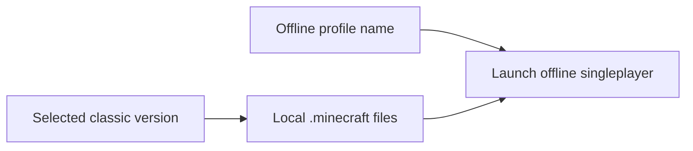

# Authentication and Launch Flow

MCLauncherRevival keeps the old launcher look, but avoids the unsafe legacy username/password login.

## Modern online flow

```mermaid
flowchart LR
    User["Player clicks Microsoft Login"]
    Browser["Browser OAuth sign-in"]
    MS["Microsoft OAuth token"]
    XBL["Xbox Live authentication"]
    XSTS["XSTS authorization"]
    MC["Minecraft services login"]
    Profile["Minecraft profile lookup"]
    Launch["Launch selected classic client"]

    User --> Browser
    Browser --> MS
    MS --> XBL
    XBL --> XSTS
    XSTS --> MC
    MC --> Profile
    Profile --> Launch
```



## Offline/classic flow



## Token cache

OAuth tokens are cached locally so the user does not need to sign in every time:

```text
%APPDATA%\.minecraft\launcher_revive\auth.properties
```

The launcher does not ask for or store raw Microsoft passwords.

Use `Forget Login` to clear cached OAuth tokens.

## Windows XP note

Windows XP is supported for offline/classic play. Modern Microsoft login and fresh HTTPS downloads
are best-effort on XP because the operating system, browser stack, Java TLS support, and root
certificates are often too old for current Microsoft/Minecraft services.
