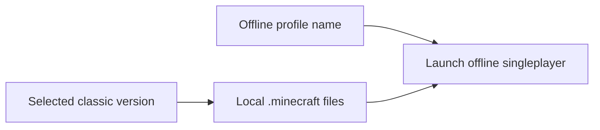

# Authentication and Launch Flow

MCLauncherRevival keeps the old launcher look, but avoids the unsafe legacy username/password login.

## Modern online flow

```mermaid
flowchart LR
    User["Player clicks Microsoft Login"]
    Browser["Default browser OAuth sign-in"]
    Redirect["Registered desktop redirect"]
    MS["Microsoft OAuth authorization code + PKCE"]
    MSToken["Microsoft OAuth access/refresh token"]
    XBL["Xbox Live authentication"]
    XSTS["XSTS authorization"]
    MC["Minecraft services login"]
    Profile["Minecraft profile lookup"]
    Launch["Launch selected classic client"]

    User --> Browser
    Browser --> Redirect
    Redirect --> MS
    MS --> MSToken
    MSToken --> XBL
    XBL --> XSTS
    XSTS --> MC
    MC --> Profile
    Profile --> Launch
```



## Offline/classic flow



## Current browser/OAuth behavior

The default alpha flow is browser-based Microsoft authorization-code login with PKCE and
`offline_access`, using Microsoft's registered desktop redirect for the default public client ID.

The normal path:

1. Opens the user's default browser.
2. Sends a high-entropy `state` value and PKCE challenge.
3. Receives the authorization response through Microsoft's registered desktop redirect.
4. Asks the user to paste the final Microsoft redirect URL, or use `Paste from Clipboard`, to finish
   the desktop OAuth handoff.
5. Validates `state`.
6. Exchanges the authorization code with the PKCE verifier.
7. Continues Xbox Live, XSTS, Minecraft services login, and profile lookup.

When Microsoft returns a refresh token, MCLauncherRevival stores it locally so future sessions can
refresh without asking the user to sign in every time.

Local `127.0.0.1` callback login can be enabled only for a custom Microsoft client ID with a
matching loopback redirect registration:

```text
-Dmclauncher.msClientId=<registered-client-id> -Dmclauncher.oauth.loopback=true
```

or:

```text
MCLR_MICROSOFT_CLIENT_ID=<registered-client-id>
```

If the default desktop redirect cannot complete, the launcher retries the paste-back handoff and
keeps Offline Play available.

The launcher does not use embedded webviews and should never ask for a raw Microsoft password.

## Token cache

OAuth tokens are cached locally so the user does not need to sign in every time:

```text
%APPDATA%\.minecraft\launcher_revive\auth.properties
```

The launcher does not ask for or store raw Microsoft passwords.

Use `Forget Login` to clear cached OAuth tokens and any leftover temporary macOS game-launch
credentials. The macOS helper also deletes its one-use launch configuration as soon as it has read
it. Local deletion does not revoke a token that Microsoft has already issued.

Tokens are sensitive. They are not raw passwords, but anyone with access to them may be able to act
as the signed-in session until the tokens expire or are revoked.

## Xbox profile requirement

The Microsoft account must have an Xbox profile before the Xbox Live/XSTS step can succeed. If XSTS
fails with `XErr: 2148916233`, open <https://start.ui.xboxlive.com/>, finish Xbox profile setup,
then use `Forget Login` and try `Microsoft Login` again.

## Windows XP note

Windows XP is supported for offline/classic play. Modern Microsoft login and fresh HTTPS downloads
are best-effort on XP because the operating system, browser stack, Java TLS support, and root
certificates are often too old for current Microsoft/Minecraft services.
