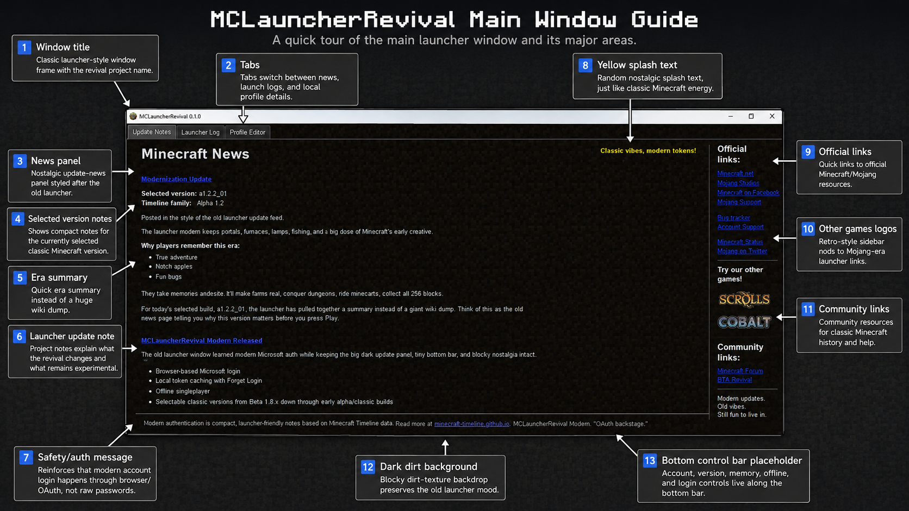
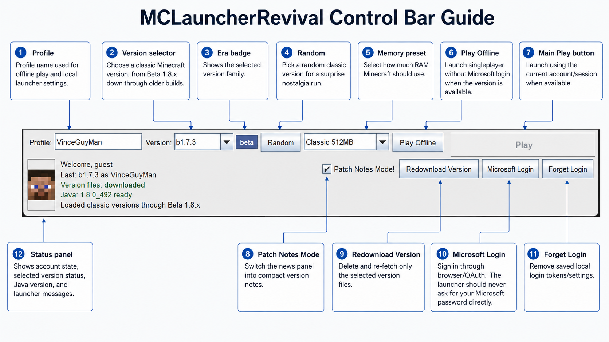
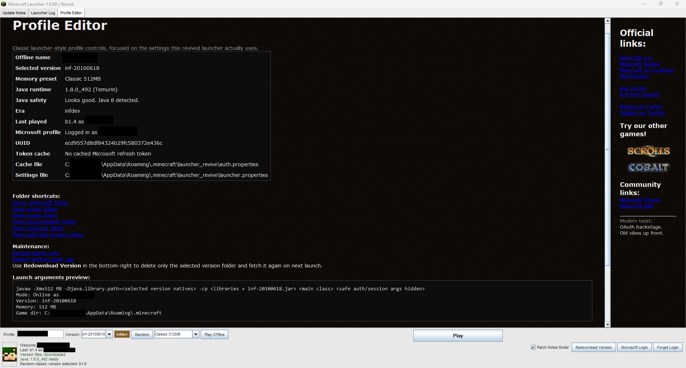
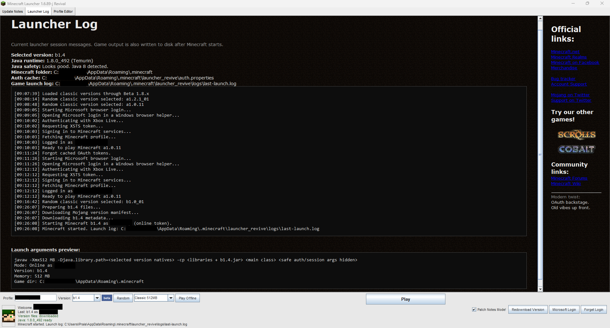
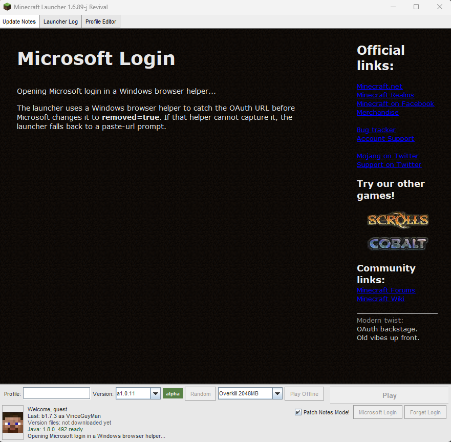
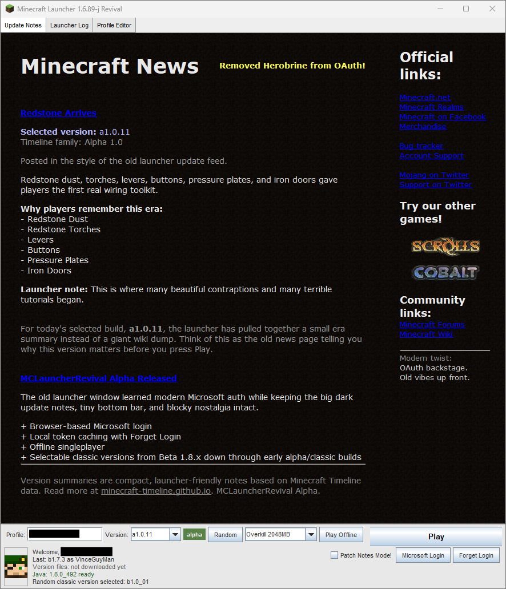
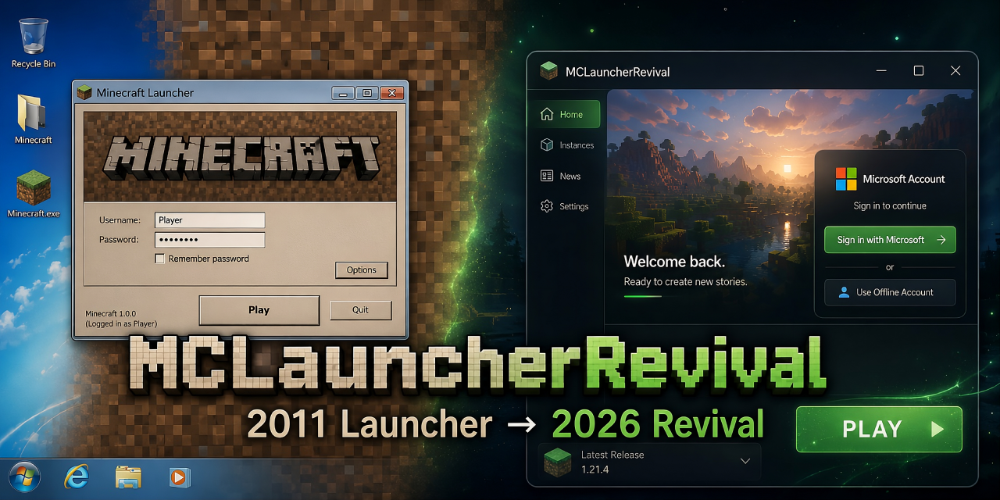

# Screenshots

This folder collects current MCLauncherRevival screenshots and annotated UI guides for the README,
release notes, and GitHub project page.

Some screenshots intentionally redact local usernames, account names, or filesystem paths.

## Main launcher

## Annotated guides

These images are useful for explaining the launcher at a glance.

## Launcher tabs

## Login flow

The launcher should use browser/OAuth login and should not ask for a Microsoft password inside the
app.

## Repository/social preview

